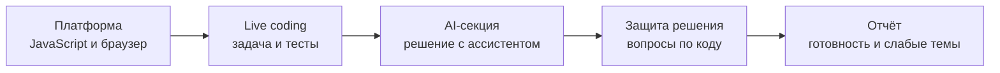
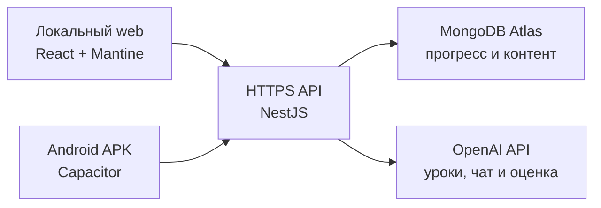

<div align="center">

# FS · Frontend Sprint

### Interview OS для системной подготовки к frontend-собеседованиям

Учебный план, AI-разборы, интервальные повторения, live coding и полноценный симулятор интервью — в одном приложении для компьютера и Android.

[](https://github.com/620474/KnowsPreparation/releases/latest)
[](https://github.com/620474/KnowsPreparation/actions/workflows/ci.yml)


[Возможности](#возможности) · [Симулятор интервью](#симулятор-интервью) · [Быстрый старт](#быстрый-старт) · [Android](#android) · [Архитектура](#архитектура)

</div>

> **Главная идея:** приложение не просто хранит галочки, а измеряет подготовку, находит слабые темы и превращает их в следующий конкретный шаг.

## Возможности

| Направление | Что умеет приложение |
| --- | --- |
| **Учебный план** | 12 недель по 120 минут в день: 11 основных недель и одна буферная |
| **Четыре трека** | Основной план, персональный AI-курс, подготовка к Яндексу и Ozon |
| **AI-разборы** | Потоковая генерация уроков, схем, квизов, практики и контекстного чата |
| **Практика** | JS-песочница с QuickJS, тест-кейсами и сохранением решений локально и в MongoDB |
| **Interview Gym** | Сессии на 5/10 минут, 30 проверяемых задач, QuickJS и автоматическое планирование повторений |
| **Собеседования** | Мок-интервью, Exam mode без AI, голосовые ответы, live coding и итоговый отчёт |
| **Аналитика** | Независимые readiness-оценки «вспомнить / написать / объяснить / защитить» |
| **Исследования** | Проекты, evidence matrix, автономный поиск, citation audit, противоречия и действия |
| **Поиск работы** | Воронка вакансий, follow-up, недельные KPI, интервью, конверсия и карьерная стратегия |
| **AI-агенты** | Проверка уроков, адаптивные интервью, разбор вакансий и durable Research Agent |
| **Надёжность** | Офлайн-кеш, очередь изменений, версионированный JSON-бэкап и восстановление |

| **12 недель** | **126 вопросов** | **244 источника** | **4 учебных трека** | **Web + Android** |
| :---: | :---: | :---: | :---: | :---: |
| 120 минут в день | с повторениями | в серверном каталоге | единый AI-контур | общий прогресс |

## Симулятор интервью

Версия 4 превратила подготовку в управляемую репетицию настоящего технического собеседования.



Доступны тренировки на **35/75 минут** и Exam mode на **60/90 минут**, в котором AI-секция и плавающий помощник скрыты до итоговой оценки. Профили общего frontend-собеседования, Яндекса и Ozon сохраняются в MongoDB, восстанавливаются после перезапуска и попадают в историю и аналитику.

## Автономные исследования

Research Agent работает на сервере и продолжает run после закрытия Android-приложения. Доступны профили технической темы, компании, вакансии, методики обучения и post-interview, а также режимы Quick, Standard и Deep.

Pipeline сохраняет каждый этап в MongoDB: протокол, поиск, red-team, синтез, citation audit и Action Mapper. Lease owner, epoch и heartbeat защищают run от параллельного выполнения, а после перезапуска агент продолжает с последнего сохранённого checkpoint. Лимиты времени, источников, AI-вызовов и Sol контролируются кодом. Источники, выводы и предлагаемые действия попадают в проект только после ручного подтверждения; статический учебный план агент автоматически не переписывает.

## Как устроено обучение

1. Открываешь тему из плана или специального трека.
2. Читаешь сохранённый AI-разбор и при необходимости уточняешь детали в чате.
3. Проходишь квиз из 10 вопросов.
4. Решение практики запускается прямо в приложении и проверяется тестами.
5. Результат влияет на интервальные повторения и список слабых тем.
6. Симулятор собирает знания, речь и код в одну тренировку интервью.

### Interview Gym

Раздел повторений больше не просит самостоятельно выбрать «Не помню / Трудно / Хорошо / Легко». Пользователь получает одну конкретную задачу: предсказать вывод кода, выбрать и объяснить ответ, исправить ошибку, написать функцию или защитить решение. Детерминированные ответы проверяются на сервере, код запускается в изолированном QuickJS, открытые ответы оцениваются по интервью-рубрике.

Перед проверкой фиксируется уверенность. Она не меняет правильность ответа, но позволяет видеть переоценку и недооценку своих знаний. Следующий интервал вычисляется автоматически, а старые ручные оценки сохраняются как исторический сигнал с низкой надёжностью.

Контент хранится на backend, поэтому новые темы, ссылки и вопросы появляются на телефоне без пересборки APK. Новая Android-версия нужна только при изменении интерфейса или клиентской логики.

## Архитектура



Frontend не требуется публиковать в интернете. Локальный сайт работает на компьютере, APK — на телефоне, а постоянно доступные API и MongoDB синхронизируют их даже при выключенном компьютере.

### Информационная архитектура

Верхний уровень состоит только из пяти устойчивых разделов:

| Раздел | Назначение |
| --- | --- |
| **Сегодня** | Следующий шаг, повторения, интервью, карьерные действия и активное исследование |
| **Подготовка** | Яндекс, Ozon, поиск работы, основной план и симулятор собеседования |
| **Знания** | Вопросы, алгоритмы, библиотека, AI-курс и аналитика |
| **Исследования** | Проекты от постановки вопроса до проверяемого вывода |
| **Ещё** | Расписание, уведомления, бэкап и подключение |

Маршруты управляются React Router и сохраняют открытый день, урок или исследование после перезагрузки страницы и в Android WebView.

## Быстрый старт

Понадобятся Node.js 22.13+ или 24+, npm и Docker. Рекомендуемая версия Node.js записана в `.nvmrc`.

```bash
cp .env.example .env
docker compose up -d mongo
npm install
npm run dev
```

После создания `.env` замените `APP_PASSWORD` и `JWT_SECRET`, затем откройте:

- клиент — `http://localhost:5173`;
- API — `http://localhost:3001/api/v1`;
- health check — `http://localhost:3001/api/health`.

## Учебные треки

| Ключ | Назначение |
| --- | --- |
| `curriculum` | Основная 12-недельная программа |
| `course` | Персональный AI-курс |
| `yandex` | Трёхнедельный спринт перед секциями Яндекса |
| `ozon` | Двухнедельный спринт по материалам интервью Ozon |

Урок, квиз, практика и чат всех треков используют единый API:

```text
POST   /api/v1/learning/tracks/:trackKey/items/:itemId/lesson
POST   /api/v1/learning/tracks/:trackKey/items/:itemId/lesson/stream
POST   /api/v1/learning/tracks/:trackKey/items/:itemId/quiz
PUT    /api/v1/learning/tracks/:trackKey/items/:itemId/practice
GET    /api/v1/learning/tracks/:trackKey/items/:itemId/chat
POST   /api/v1/learning/tracks/:trackKey/items/:itemId/chat
POST   /api/v1/learning/tracks/:trackKey/items/:itemId/chat/stream
DELETE /api/v1/learning/tracks/:trackKey/items/:itemId/chat
```

Новый трек добавляется через `apps/api/src/learning/track-registry.ts`: достаточно описать дни, цель чата и инструкции генерации без новых контроллеров.

## Android

### Установка готовой версии

Последний APK публикуется в [GitHub Releases](https://github.com/620474/KnowsPreparation/releases/latest). Он подключается к тому же API и использует тот же прогресс, что и локальный web-клиент.

### Локальная сборка

Понадобятся Android Studio, Android SDK и JDK 21+.

```bash
npm run android:sync
npm run android:open
```

Для ручной debug-сборки:

```bash
cd apps/client/android
./gradlew assembleDebug
```

Результат появится в `apps/client/android/app/build/outputs/apk/debug/app-debug.apk`.

## Данные и офлайн-режим

- Прочитанные статьи и основной bootstrap кешируются в IndexedDB.
- Изменения прогресса сохраняются локально и синхронизируются после восстановления сети.
- Решения практики имеют версии: более новая локальная работа не затирается старой серверной копией.
- В разделе «Ещё» можно экспортировать пользовательские данные в JSON и восстановить их через merge; в файл также входят грязные и конфликтные локальные черновики.
- В бэкап не входят пароль, JWT, адрес API и строка подключения MongoDB.
- Голосовая запись отправляется на API для расшифровки, но исходное аудио не сохраняется.

## Обновление материалов

Каталог находится в `apps/api/src/learning/data/resources.json`, а прогресс и настройки — в MongoDB.

1. Обновите JSON, сохранив стабильный уникальный `id` и HTTPS-ссылку.
2. Запустите `npm run typecheck && npm test`.
3. Отправьте изменения в GitHub.
4. Дождитесь автоматического деплоя API.

Статический контент загружается через `GET /api/v1/learning/bootstrap/content`, а изменяемый прогресс — через `GET /api/v1/learning/bootstrap/progress`.

<details>
<summary><strong>MongoDB Atlas и production API</strong></summary>

Для независимой работы компьютера и телефона:

1. Создайте MongoDB Atlas cluster и отдельного database user.
2. Разрешите подключение только с IP облачного API-сервера.
3. Разместите API через `Dockerfile.api` или обычный Node.js runtime.
4. Передайте API переменные `MONGODB_URI`, `APP_PASSWORD`, `JWT_SECRET`, `PORT` и `CLIENT_ORIGINS`.
5. В клиенте укажите HTTPS-адрес вида `https://your-api.example.com/api/v1`.

Никогда не добавляйте MongoDB connection string в Vite-переменные, Android-проект или Git.

</details>

<details>
<summary><strong>GitHub и Northflank</strong></summary>

Рекомендуемый поток выпуска:

```text
feature branch → pull request → GitHub Actions → merge в main → Northflank
```

Workflow `.github/workflows/ci.yml` запускает typecheck, lint, тесты и сборку для pull request и каждого обновления `main`.

Для первого деплоя:

1. Подключите репозиторий через Northflank GitHub App.
2. Создайте `Combined Service` из ветки `main`.
3. Выберите build context `/` и Dockerfile path `/Dockerfile.api`.
4. Откройте публичный HTTP-порт `3001`.
5. Добавьте runtime variables:

   ```text
   NODE_ENV=production
   PORT=3001
   MONGODB_URI=<MongoDB Atlas URI с именем базы frontend_prep>
   APP_PASSWORD=<личный пароль, не менее 12 символов>
   JWT_SECRET=<случайная строка, не менее 32 символов>
   OPENAI_API_KEY=<ключ для AI-уроков, чата, оценки и расшифровки>
   OPENAI_MODEL=gpt-5.6-sol
   OPENAI_REVIEW_MODEL=gpt-5.6-terra
   OPENAI_AGENT_MODEL=gpt-5.6-terra
   OPENAI_RESEARCH_MODEL=gpt-5.6-sol
   OPENAI_RESEARCH_MODEL_COST_CLASS=sol
   OPENAI_REVIEW_MODEL_COST_CLASS=standard
   OPENAI_TRANSCRIPTION_MODEL=gpt-4o-mini-transcribe
   ```

6. Настройте проверки контейнера:
   - startup и readiness — `GET /api/health`;
   - liveness — `GET /api/health/live`.
7. Укажите в web-клиенте и Android адрес `https://<northflank-domain>/api/v1`.

Для Atlas рекомендуется выделенный Northflank egress IP с правилом `/32`. Доступ `0.0.0.0/0` допустим только для короткой первичной проверки.

API пишет структурированные JSON-логи и добавляет `X-Request-Id`, но не логирует авторизацию, cookie, AI-запросы и пользовательские ответы.

</details>

<details>
<summary><strong>Версии и релизы</strong></summary>

Версия определяется Git-тегами и Conventional Commits. После успешного push в `main` запускается `semantic-release`, создаётся GitHub Release и прикладывается APK `KnowsPreparation-vX.Y.Z.apk`.

- `fix: ...` — patch: `1.0.0` → `1.0.1`;
- `feat: ...` — minor: `1.0.0` → `1.1.0`;
- `feat!: ...` или `BREAKING CHANGE:` — major: `1.0.0` → `2.0.0`;
- `docs:`, `test:`, `chore:` — сами по себе релиз не создают.

Поля `version` в workspace-пакетах содержат `0.0.0-semantic-release`: фактическая версия берётся из Git-тега. Android `versionName` и `versionCode` вычисляются из той же версии.

APK подписывается постоянным ключом из GitHub Secret `ANDROID_DEBUG_KEYSTORE_BASE64`. Его нельзя добавлять в репозиторий или заменять, иначе Android не сможет установить обновление поверх существующего приложения.

Локальная проверка конфигурации:

```bash
npm run release:dry-run
```

</details>

## Стек

| Слой | Технологии |
| --- | --- |
| Client | React, TypeScript, React Router, Mantine, Vite, TanStack Query |
| Android | Capacitor, Android SDK, локальные уведомления и запись голоса |
| API | NestJS, TypeScript, SSE, JWT |
| Data | MongoDB, Mongoose, IndexedDB |
| AI | OpenAI API, потоковая генерация, транскрипция и оценка |
| Practice | QuickJS, тест-кейсы и изолированный запуск решений |
| Delivery | Docker, GitHub Actions, semantic-release, Northflank |

## Проверки

```bash
npm run lint
npm run typecheck
npm test
npm run build
```

## Структура проекта

```text
apps/
├── api/                         NestJS API и MongoDB-модели
│   └── src/
│       ├── career/              вакансии, интервью и карьерные действия
│       ├── learning/            треки, прогресс, AI и интервью
│       └── research/            отдельный HTTP-модуль исследований
└── client/                      React, Mantine и Capacitor Android
    └── src/
        ├── features/            подготовка, знания, поиск работы и исследования
        ├── components/          общие учебные инструменты и App Shell
        └── hooks/               навигация и доменные действия
packages/
└── contracts/                   общие Zod-контракты API и клиента
```

## Версия 5

Версия 5 перестраивает приложение вокруг задач пользователя, а не количества функций: пять стабильных разделов, отдельные центры «Подготовка» и «Знания», полноценные вложенные маршруты и изолированный API-модуль исследований. Данные MongoDB и существующий прогресс остаются совместимыми.

---

<div align="center">

**Учись → практикуйся → проходи интервью → разбирай результат**

[Скачать последнюю версию](https://github.com/620474/KnowsPreparation/releases/latest) · [Открыть репозиторий](https://github.com/620474/KnowsPreparation)

</div>
